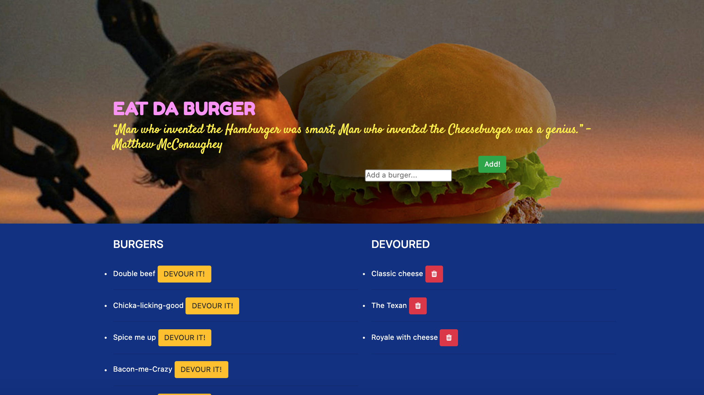

# Node-Eat-Da-Burger

## Description
This is a restaurant application that follows the MVC design pattern to create a burger logger using MySQL, Node, Express and Handlebars.  

It allows a user to enter a burger name of their choice, which then gets added to the wait list - waiting to be devoured. Once a user clicks the Devour it! button, the burger moves to the right side of the page. Every burger will be stores in the database. 

Deployed Heroku application:
https://boiling-springs-85381.herokuapp.com/

## User Story
AS A user, I want to be able to add a burger to the menu, devour it and/or delete it. 
I WANT to save all data into the database, whether devoured or not. 

## Application

